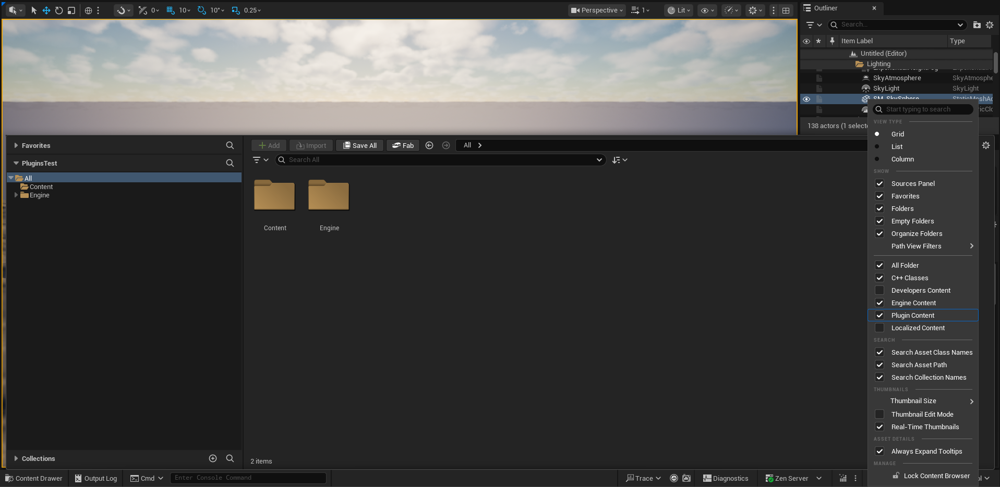
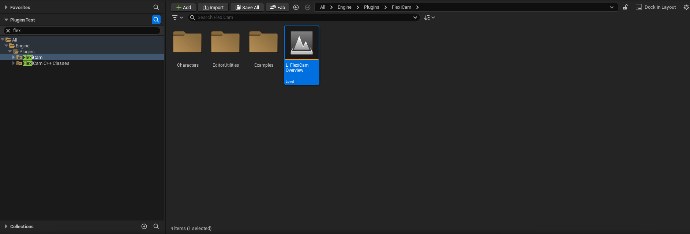

# Examples

Plugin has built-in example level that contains some examples

## How to find example content

To view the content folder containing the examples, follow these steps

- Open `Content Browser settings` and enable `Engine Content` and `Plugin Content` properties
    

- Search for "FlexiCam" in `Sources panel`

    

- Open `FlexiCam` folder you will find `L_FlexiCamOverview` map there

    

## [Level](example-level.md)

## [Third Person Camera Mode](third-person-mode.md)

## [Over Shoulder Camera Mode](over-shoulder-mode.md)

## [Top Down Camera Mode](top-down-mode.md)

## [Fighting Camera Mode](fighting-mode.md)
